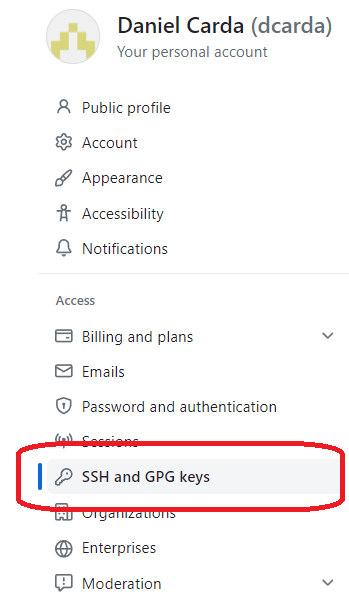
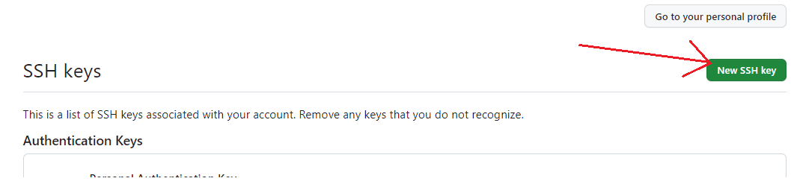
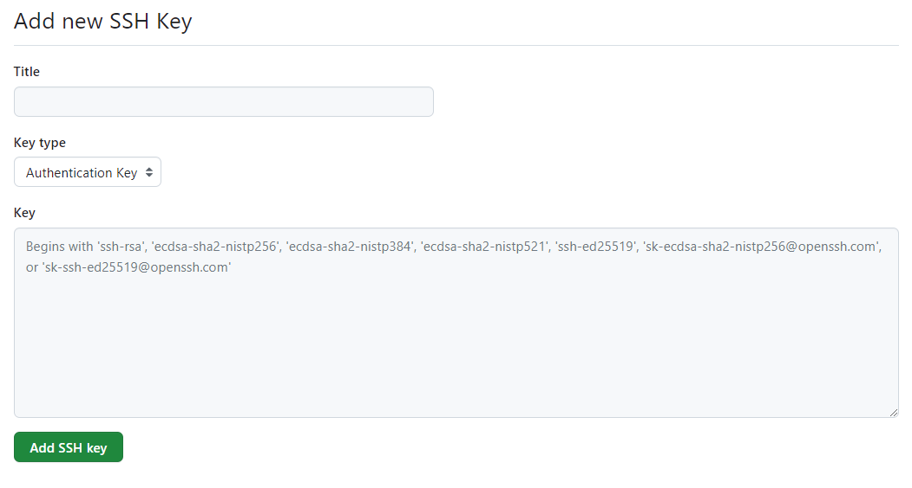

# WebDemonstrator
Demonstration JBoss Application


starting point
https://edwardcher.typepad.com/breaking_the_echo_chamber/2013/06/build-jboss-ejb-project-in-maven.html


----
Build Environment
=========================

The following instruction outline how to set up the environement which will be use
to build this application

Java
-------------------------
This build utilizes the Amazon Corretto 21.  You can download the installer here:\
&nbsp;&nbsp;&nbsp;&nbsp;&nbsp;https://docs.aws.amazon.com/corretto/latest/corretto-21-ug/downloads-list.html

MSYS2
-------------------------

MSYS2 is a collection of tools and libraries providing you with an easy-to-use environment for building, installing and running native Windows software.

It consists of a command line terminal called mintty, bash, version control systems like git and subversion, tools like tar and awk and even build systems like autotools

The terminal used for building this application is UCRT64.

### Installing

MSYS2 can be downloaded and installed from here:\
&nbsp;&nbsp;&nbsp;&nbsp;&nbsp;https://www.msys2.org/\
&nbsp;&nbsp;&nbsp;&nbsp;&nbsp;https://packages.msys2.org/package/git


### Updating MSYS2

Occasionally, you should go through and update executables for the terminal console.  The following are a few suggestions on commands to run\
&nbsp;&nbsp;&nbsp;&nbsp;&nbsp;pacman -Suy \
&nbsp;&nbsp;&nbsp;&nbsp;&nbsp;paccache -r \
&nbsp;&nbsp;&nbsp;&nbsp;&nbsp;pacman -Qm 

More information on updating can be found here:\
&nbsp;&nbsp;&nbsp;&nbsp;&nbsp;https://www.msys2.org/docs/updating/


### Adding Git Libraries

In order to update the command line with the repo status it's necessary to add several libraries
to the MSYS2 path.

First, go to this web
Program Files/Git/etc/profile.d/git-prompt.sh:  31:  
https://github.com/git/git/tree/master/contrib/completion


<MSYS2 Root>\etc\profile.d


\
&nbsp;&nbsp;&nbsp;&nbsp;&nbsp;git-completion.bash\
&nbsp;&nbsp;&nbsp;&nbsp;&nbsp;git-completion.tcsh\
&nbsp;&nbsp;&nbsp;&nbsp;&nbsp;git-completion.zsh\
&nbsp;&nbsp;&nbsp;&nbsp;&nbsp;git-prompt.sh


----

Setting up the Git SSH Keys
-------------------------
<details>
  <summary>Click me</summary>

You might as well set these up early.  You're going to need them and it will make checking in and out much easier.

The good news is generating SSH keys is pretty simple.  Also, you can
backup the .ssh directory which will be created and keep it (pretty much)
forever.  When ever I build a new machine I just back up the old .ssh
directory and move it to the new machine.

Follow this 
[link](https://docs.github.com/en/authentication/connecting-to-github-with-ssh/generating-a-new-ssh-key-and-adding-it-to-the-ssh-agent#generating-a-new-ssh-key)
for instructions on how to generate your SSH keys.


</details>

----
Installing your SSH Key in GitHub
-------------------------
<details>
  <summary>Click me</summary>

Now that you've got your SSH key generated, you need to install the public key in GitHub.  Fortunately, this
is pretty easy to do.

Log on to your GitHub Account click on the big icon on the left-side of the screen.  This will take you to your profile page.











On your system, the .ssh directory will be located under your root home.

Look for a file called:

    id_rsa.pub

Add the contents to the "keys" text field.  

You should be good!


</details>


----

Setting up the .gitconfig
-------------------------

<details>
  <summary>Click me</summary>

The .gitconfig contains numerious value-pairs which are used to 
facilitate your access to the Git environment.

In this example 


https://sourceforge.net/projects/winmerge/


https://www.scootersoftware.com/


### .gitconfig Example
  ```typescript
[user]
    name = Daniel Carda
    email = GoneBy2025@CardaTechnologies.com
    username = dcarda

[diff]
    tool = winmerge
    guitool = winmerge
[difftool]
    prompt = false
[difftool "winmerge"]
    path = D:/Tools/WinMerge/WinMergeU.exe
    cmd = "'D:/Tools/WinMerge/WinMergeU.exe'" -e "$LOCAL" "$REMOTE"

[merge]
    prompt=false
    tool = BeyondCompare4
[mergetool "BeyondCompare4"]
    trustExitCode=true
    path = D:/Tools/Programming/BeyondCompare4/BComp.exe
    cmd = \"D:/Tools/Programming/BeyondCompare4/BComp.exe\" \"$LOCAL\" \"$REMOTE\" \"$BASE\" \"$MERGED\"
    keepBackup = true

[push]
    default = simple

[http]
    sslVerify = false
    postBuffer = 1048576000
    lowSpeedLimit = 0
    lowSpeedTime = 999999
#    proxy = http://<PROXY IP ADDRESS>:8080/

[core]
    preloadindex = true
    fscache = true
    editor = \"C:\\Program Files\\Notepad++\\notepad++.exe\" -multiInst -nosession
    autocrlf = false
    symlinks=false
    repositoryformatversion=0
    filemode=false
    bare=false
    logallrefupdates=true
    hidedotfiles=dotGitOnly
    ignorecase=true
#    http.sslverify=false

[color]
    diff=auto
    status=auto
    branch=auto
    interactive=true

[filter "lfs"]
    clean = git-lfs clean -- %f
    smudge = git-lfs smudge -- %f
    process = git-lfs filter-process
    required = true

[gc]
    auto = 256

[help]
    format=html

[status]
    submoduleSummary = false

[alias]
    lg = log --color --graph --pretty=format:'%Cred%h%Creset -%C(yellow)%d%Creset %s %Cgreen(%cr)%C(bold blue)<%an>%Creset' --abbrev-commit
  ```

</details>


Setting up the .bashrc
-------------------------


<details>
  <summary>Click me</summary>

### Heading
1. Foo
2. Bar
     * Baz
     * Qux

### Some Javascript
  ```typescript
# =============================================================================
# =============================================================================

#  Customize BASH PS1 prompt to show current GIT repository and branch.
#  by Mike Stewart - http://MediaDoneRight.com

#  This will change some of the directory colors.
#  Really good explanation here:
#    https://www.cyberciti.biz/faq/apple-mac-osx-terminal-color-ls-output-option/
export LSCOLORS=GxFxCxDxBxegedabagaced

#  SETUP CONSTANTS
#  Bunch-o-predefined colors.  Makes reading code easier than escape sequences.
#  I don't remember where I found this.  o_O

# Reset
Color_Off="\[\033[0m\]"       # Text Reset

# Regular Colors
Black="[\033[0;30m\]"         # Black
Red="\[\033[0;31m\]"            # Red
Green="\[\033[0;32m\]"        # Green
Yellow="\[\033[0;33m\]"       # Yellow
Blue="\[\033[0;34m\]"         # Blue
Purple="\[\033[0;35m\]"       # Purple
Cyan="\[\033[0;36m\]"         # Cyan
White="\[\033[0;37m\]"        # White

# Bold
BBlack="\[\033[1;30m\]"       # Black
BRed="\[\033[1;31m\]"         # Red
BGreen="\[\033[1;32m\]"       # Green
BYellow="\[\033[1;33m\]"      # Yellow
BBlue="\[\033[1;34m\]"        # Blue
BPurple="\[\033[1;35m\]"      # Purple
BCyan="\[\033[1;36m\]"        # Cyan
BWhite="\[\033[1;37m\]"       # White

# Underline
UBlack="\[\033[4;30m\]"       # Black
URed="\[\033[4;31m\]"         # Red
UGreen="\[\033[4;32m\]"       # Green
UYellow="\[\033[4;33m\]"      # Yellow
UBlue="\[\033[4;34m\]"        # Blue
UPurple="\[\033[4;35m\]"      # Purple
UCyan="\[\033[4;36m\]"        # Cyan
UWhite="\[\033[4;37m\]"       # White

# Background
On_Black="\[\033[40m\]"       # Black
On_Red="\[\033[41m\]"         # Red
On_Green="\[\033[42m\]"       # Green
On_Yellow="\[\033[43m\]"      # Yellow
On_Blue="\[\033[44m\]"        # Blue
On_Purple="\[\033[45m\]"      # Purple
On_Cyan="\[\033[46m\]"        # Cyan
On_White="\[\033[47m\]"       # White

# High Intensity
IBlack="\[\033[0;90m\]"       # Black
IRed="\[\033[0;91m\]"         # Red
IGreen="\[\033[0;92m\]"       # Green
IYellow="\[\033[0;93m\]"      # Yellow
IBlue="\[\033[0;94m\]"        # Blue
IPurple="\[\033[0;95m\]"      # Purple
ICyan="\[\033[0;96m\]"        # Cyan
IWhite="\[\033[0;97m\]"       # White

# Bold High Intensity
BIBlack="\[\033[1;90m\]"      # Black
BIRed="\[\033[1;91m\]"        # Red
BIGreen="\[\033[1;92m\]"      # Green
BIYellow="\[\033[1;93m\]"     # Yellow
BIBlue="\[\033[1;94m\]"       # Blue
BIPurple="\[\033[1;95m\]"     # Purple
BICyan="\[\033[1;96m\]"       # Cyan
BIWhite="\[\033[1;97m\]"      # White

# High Intensty backgrounds
On_IBlack="\[\033[0;100m\]"   # Black
On_IRed="\[\033[0;101m\]"     # Red
On_IGreen="\[\033[0;102m\]"   # Green
On_IYellow="\[\033[0;103m\]"  # Yellow
On_IBlue="\[\033[0;104m\]"    # Blue
On_IPurple="\[\033[10;95m\]"  # Purple
On_ICyan="\[\033[0;106m\]"    # Cyan
On_IWhite="\[\033[0;107m\]"   # White

# Various variables you might want for your PS1 prompt instead
Time12h="\T"
Time12a="\@"
PathShort="\w"
PathFull="\W"
NewLine="\n"
Jobs="\j"

# This PS1 snippet was adopted from code for MAC/BSD I saw from: http://allancraig.net/index.php?option=com_content&view=article&id=108:ps1-export-command-for-git&catid=45:general&Itemid=96
    # I tweaked it to work on UBUNTU 11.04 & 11.10 plus made it mo' better
export PS1='\n┌─'$IGreen$Time12h$Color_Off'$(git branch &>/dev/null;\
if [ $? -eq 0 ]; then \
  echo "$(echo `git status` | grep "nothing to commit" > /dev/null 2>&1; \
  if [ "$?" -eq "0" ]; then \
            # @4 - Clean repository - nothing to commit
echo "'$Green'"$(__git_ps1 " (%s)"); \
else \
# @5 - Changes to working tree
echo "'$IRed'"$(__git_ps1 " {%s}"); \
  fi) \n'$Color_Off'│ '$BYellow$PathShort$Color_Off'   \n└─▶"; \
else \
  # @2 - Prompt when not in GIT repo
echo " '$Yellow$PathShort$Color_Off'   \n└─▶"; \
fi)'

export GIT_SSL_NO_VERIFY=true
git config --global alias.lg "log --color --graph --pretty=format:'%Cred%h%Creset -%C(yellow)%d%Creset %s %Cgreen(%cr)%C(bold blue)<%an>%Creset' --abbrev-commit"

#
long_ls() {

    local VAR="Permissions|Owner|   Group| Size| Modified|  Name"

    if [ ! "${1}" ]; then
    echo -e "$VAR" | column -t -s"|" && ls -l
else
    echo -e "$VAR" | column -t -s"|" && ls -l "${1}"
    fi

}

alias lls=$"long_ls ${1}"

# -------------------------------------------------------------------------
#  Good Alias Stuff
# -------------------------------------------------------------------------

# -------------------------------------------------------------------------
#  This will clear the console screen and history.
    alias clear="echo -ne '\033c'"

# -------------------------------------------------------------------------
#   Git commants
alias gw='git whatchanged'
alias gs='git status'
alias gitlg="git log --graph --pretty=format:'%Cred%h%Creset -%C(yellow)%d%Creset %s %Cgreen(%cr) %C(bold blue)<%an>%Creset' --abbrev-commit"

# -------------------------------------------------------------------------
#  Nice Bash Commands: https://github.com/vikaskyadav/awesome-bash-alias
    alias cpv='rsync -ah --info=progress2'
alias scan='grep -niRHT  --color '
alias ll='ls -AlF --color=auto --group-directories-first'


# -------------------------------------------------------------------------
# Docker stuff
# Clean stopped containers
alias cco="docker ps -a | grep "Exited" | awk '{print $1}' | xargs docker rm"
# After that, clean unused images to reclaim disk space
alias cimg="docker images | grep none | awk '{print \$3}' | xargs docker rmi"
# Finally the regular stuff just to save typing.
    alias dps="docker ps -a"
alias di="docker images"
alias drmi="docker rmi"
alias drm="docker rm"
  ```
</details>


----


GitHub Flavored Markdown
================================

*View the [source of this content](http://github.github.com/github-flavored-markdown/sample_content.html).*

Let's get the whole "linebreak" thing out of the way. The next paragraph contains two phrases separated by a single newline character:

Roses are red
Violets are blue

The next paragraph has the same phrases, but now they are separated by two spaces and a newline character:

Roses are red  
Violets are blue

Oh, and one thing I cannot stand is the mangling of words with multiple underscores in them like perform_complicated_task or do_this_and_do_that_and_another_thing.

A bit of the GitHub spice
-------------------------

In addition to the changes in the previous section, certain references are auto-linked:

* SHA: be6a8cc1c1ecfe9489fb51e4869af15a13fc2cd2
* User@SHA ref: mojombo@be6a8cc1c1ecfe9489fb51e4869af15a13fc2cd2
* User/Project@SHA: mojombo/god@be6a8cc1c1ecfe9489fb51e4869af15a13fc2cd2
* \#Num: #1
* User/#Num: mojombo#1
* User/Project#Num: mojombo/god#1

These are dangerous goodies though, and we need to make sure email addresses don't get mangled:

My email addy is tom@github.com.

Math is hard, let's go shopping
-------------------------------

In first grade I learned that 5 > 3 and 2 < 7. Maybe some arrows. 1 -> 2 -> 3. 9 <- 8 <- 7.

Triangles man! a^2 + b^2 = c^2

We all like making lists
------------------------

The above header should be an H2 tag. Now, for a list of fruits:

* Red Apples
* Purple Grapes
* Green Kiwifruits

Let's get crazy:

1.  This is a list item with two paragraphs. Lorem ipsum dolor
    sit amet, consectetuer adipiscing elit. Aliquam hendrerit
    mi posuere lectus.

    Vestibulum enim wisi, viverra nec, fringilla in, laoreet
    vitae, risus. Donec sit amet nisl. Aliquam semper ipsum
    sit amet velit.

2.  Suspendisse id sem consectetuer libero luctus adipiscing.

What about some code **in** a list? That's insane, right?

1. In Ruby you can map like this:

        ['a', 'b'].map { |x| x.uppercase }

2. In Rails, you can do a shortcut:

        ['a', 'b'].map(&:uppercase)

Some people seem to like definition lists

<dl>
  <dt>Lower cost</dt>
  <dd>The new version of this product costs significantly less than the previous one!</dd>
  <dt>Easier to use</dt>
  <dd>We've changed the product so that it's much easier to use!</dd>
</dl>

I am a robot
------------

Maybe you want to print `robot` to the console 1000 times. Why not?

    def robot_invasion
      puts("robot " * 1000)
    end

You see, that was formatted as code because it's been indented by four spaces.

How about we throw some angle braces and ampersands in there?

    <div class="footer">
        &copy; 2004 Foo Corporation
    </div>

Set in stone
------------

Preformatted blocks are useful for ASCII art:

<pre>
             ,-. 
    ,     ,-.   ,-. 
   / \   (   )-(   ) 
   \ |  ,.>-(   )-< 
    \|,' (   )-(   ) 
     Y ___`-'   `-' 
     |/__/   `-' 
     | 
     | 
     |    -hrr- 
  ___|_____________ 
</pre>

Playing the blame game
----------------------

If you need to blame someone, the best way to do so is by quoting them:

> I, at any rate, am convinced that He does not throw dice.

Or perhaps someone a little less eloquent:

> I wish you'd have given me this written question ahead of time so I
> could plan for it... I'm sure something will pop into my head here in
> the midst of this press conference, with all the pressure of trying to
> come up with answer, but it hadn't yet...
>
> I don't want to sound like
> I have made no mistakes. I'm confident I have. I just haven't - you
> just put me under the spot here, and maybe I'm not as quick on my feet
> as I should be in coming up with one.

Table for two
-------------

<table>
  <tr>
    <th>ID</th><th>Name</th><th>Rank</th>
  </tr>
  <tr>
    <td>1</td><td>Tom Preston-Werner</td><td>Awesome</td>
  </tr>
  <tr>
    <td>2</td><td>Albert Einstein</td><td>Nearly as awesome</td>
  </tr>
</table>

Crazy linking action
--------------------

I get 10 times more traffic from [Google] [1] than from
[Yahoo] [2] or [MSN] [3].

[1]: http://google.com/        "Google"
[2]: http://search.yahoo.com/  "Yahoo Search"
[3]: http://search.msn.com/    "MSN Search"


